# Happy Speller Platform - Detailed Architecture Diagram

## 🏗️ Complete CI/CD Pipeline Architecture

```mermaid
graph TB
    subgraph "Development Environment"
        DEV[👨‍💻 Developer]
        CODE[📝 Source Code]
        DEV --> CODE
    end

    subgraph "Source Control & Repository"
        GITEA[🔄 Gitea Server<br/>192.168.50.130:3000]
        REPO[📚 Git Repository<br/>happy-speller-platform]
        CODE --> GITEA
        GITEA --> REPO
    end

    subgraph "CI/CD Pipeline - Jenkins"
        JENKINS[🔧 Jenkins Server<br/>192.168.50.247:8080]
        subgraph "Pipeline Stages"
            CHECKOUT[1️⃣ Checkout Code]
            BUILD[2️⃣ Build & Lint<br/>npm install, ESLint]
            TEST[3️⃣ Unit Tests<br/>Jest, Coverage]
            SECURITY[4️⃣ Security Scan<br/>npm audit]
            DOCKER_BUILD[5️⃣ Build Image<br/>Multi-stage Docker]
            ARTIFACTS[6️⃣ Upload Artifacts<br/>to MinIO]
            DEPLOY_K8S[7️⃣ Deploy K8s<br/>Helm Charts]
            SMOKE_TEST[8️⃣ Smoke Tests<br/>Health Checks]
            GITOPS_UPDATE[9️⃣ Update GitOps<br/>Image Tags]
            NOTIFY[🔟 Notifications<br/>Status Updates]
        end
        REPO --> JENKINS
        JENKINS --> CHECKOUT
        CHECKOUT --> BUILD
        BUILD --> TEST
        TEST --> SECURITY
        SECURITY --> DOCKER_BUILD
        DOCKER_BUILD --> ARTIFACTS
        ARTIFACTS --> DEPLOY_K8S
        DEPLOY_K8S --> SMOKE_TEST
        SMOKE_TEST --> GITOPS_UPDATE
        GITOPS_UPDATE --> NOTIFY
    end

    subgraph "Container Registry & Artifacts"
        REGISTRY[🐳 Docker Registry<br/>registry.local:5000]
        MINIO[🗄️ MinIO Object Storage<br/>192.168.50.177:9001]
        subgraph "MinIO Buckets"
            ARTIFACTS_BUCKET[📦 artifacts]
            LOGS_BUCKET[📋 logs]
            DOCS_BUCKET[📚 docs]
            BACKUPS_BUCKET[💾 backups]
            REPORTS_BUCKET[📊 reports]
        end
        DOCKER_BUILD --> REGISTRY
        ARTIFACTS --> MINIO
        MINIO --> ARTIFACTS_BUCKET
        MINIO --> LOGS_BUCKET
        MINIO --> DOCS_BUCKET
        MINIO --> BACKUPS_BUCKET
        MINIO --> REPORTS_BUCKET
    end

    subgraph "Infrastructure as Code"
        TERRAFORM[🏗️ Terraform<br/>State in MinIO]
        ANSIBLE[⚙️ Ansible<br/>Configuration Mgmt]
        subgraph "Terraform Resources"
            K8S_NS[📋 Kubernetes Namespace]
            SECRETS[🔐 K8s Secrets]
            NETWORK_POL[🛡️ Network Policies]
            RESOURCE_QUOTA[📊 Resource Quotas]
            LIMIT_RANGES[⚖️ Limit Ranges]
        end
        TERRAFORM --> K8S_NS
        TERRAFORM --> SECRETS
        TERRAFORM --> NETWORK_POL
        TERRAFORM --> RESOURCE_QUOTA
        TERRAFORM --> LIMIT_RANGES
    end

    subgraph "Kubernetes Cluster"
        MASTER[🎛️ Control Plane]
        subgraph "Worker Nodes"
            NODE1[🖥️ Worker Node 1]
            NODE2[🖥️ Worker Node 2]
            NODE3[🖥️ Worker Node 3]
        end
        
        subgraph "Demo Namespace"
            subgraph "Happy Speller Application"
                DEPLOY[🚀 Deployment<br/>2 Replicas]
                PODS[🏠 Pods<br/>happy-speller]
                SERVICE[🌐 Service<br/>ClusterIP:8080]
                INGRESS[🚪 Ingress<br/>External Access]
                CONFIGMAP[⚙️ ConfigMap<br/>App Config]
                K8S_SECRET[🔒 Secrets<br/>MinIO Creds]
            end
            
            subgraph "Monitoring & Health"
                HPA[📈 HPA<br/>Auto-scaling]
                PDB[🛡️ Pod Disruption<br/>Budget]
                SERVICE_MON[📊 ServiceMonitor<br/>Prometheus Ready]
            end
        end
        
        MASTER --> NODE1
        MASTER --> NODE2
        MASTER --> NODE3
        DEPLOY_K8S --> DEPLOY
        DEPLOY --> PODS
        PODS --> SERVICE
        SERVICE --> INGRESS
        CONFIGMAP --> PODS
        K8S_SECRET --> PODS
        HPA --> DEPLOY
        PDB --> DEPLOY
    end

    subgraph "GitOps - ArgoCD (Optional)"
        ARGOCD[🔄 ArgoCD]
        subgraph "GitOps Applications"
            DEV_APP[📱 Dev App]
            STAGING_APP[🎭 Staging App]
            PROD_APP[🏭 Production App]
        end
        GITOPS_REPO[📚 GitOps Repository<br/>Environment Configs]
        GITOPS_UPDATE --> GITOPS_REPO
        GITOPS_REPO --> ARGOCD
        ARGOCD --> DEV_APP
        ARGOCD --> STAGING_APP
        ARGOCD --> PROD_APP
    end

    subgraph "Application Components"
        subgraph "Frontend - Happy Speller App"
            HTML[🌐 HTML5 SPA<br/>Spelling & Math Games]
            CSS[🎨 CSS3 Styling<br/>Responsive Design]
            JS[⚡ Vanilla JavaScript<br/>Game Logic]
            PWA[📱 PWA Features<br/>Offline Support]
        end
        
        subgraph "Backend - Node.js"
            EXPRESS[🚀 Express Server<br/>Port 8080]
            HEALTH_EP[❤️ Health Endpoint<br/>/healthz]
            VERSION_EP[ℹ️ Version Endpoint<br/>/api/version]
            STATIC_FILES[📁 Static File Server<br/>/public]
        end
        
        PODS --> EXPRESS
        EXPRESS --> HEALTH_EP
        EXPRESS --> VERSION_EP
        EXPRESS --> STATIC_FILES
        STATIC_FILES --> HTML
        HTML --> CSS
        HTML --> JS
        JS --> PWA
    end

    subgraph "Testing & Quality Assurance"
        UNIT_TESTS[🧪 Unit Tests<br/>Jest Framework]
        INTEGRATION_TESTS[🔗 Integration Tests<br/>Supertest API]
        COVERAGE[📊 Code Coverage<br/>HTML Reports]
        LINT[✅ Code Quality<br/>ESLint]
        SECURITY_AUDIT[🛡️ Security Audit<br/>npm audit]
        
        TEST --> UNIT_TESTS
        TEST --> INTEGRATION_TESTS
        TEST --> COVERAGE
        BUILD --> LINT
        SECURITY --> SECURITY_AUDIT
    end

    subgraph "Monitoring & Observability"
        HEALTH_CHECKS[❤️ Health Monitoring]
        METRICS[📊 Resource Metrics]
        LOGS[📋 Application Logs]
        ALERTS[🚨 Alerts & Notifications]
        
        SMOKE_TEST --> HEALTH_CHECKS
        PODS --> METRICS
        PODS --> LOGS
        HEALTH_CHECKS --> ALERTS
    end

    subgraph "Security & Compliance"
        RBAC[👥 RBAC<br/>Role-based Access]
        NET_POLICIES[🛡️ Network Policies<br/>Pod Isolation]
        SEC_CONTEXTS[🔒 Security Contexts<br/>Non-root User]
        SECRETS_MGMT[🗝️ Secrets Management<br/>K8s Secrets]
        
        K8S_NS --> RBAC
        NETWORK_POL --> NET_POLICIES
        PODS --> SEC_CONTEXTS
        K8S_SECRET --> SECRETS_MGMT
    end

    subgraph "External Access & Load Balancing"
        LB[⚖️ Load Balancer]
        USERS[👥 End Users<br/>Students & Teachers]
        
        INGRESS --> LB
        LB --> USERS
    end

    %% Styling
    classDef primaryService fill:#e1f5fe,stroke:#01579b,stroke-width:2px
    classDef infrastructure fill:#f3e5f5,stroke:#4a148c,stroke-width:2px
    classDef application fill:#e8f5e8,stroke:#1b5e20,stroke-width:2px
    classDef monitoring fill:#fff3e0,stroke:#e65100,stroke-width:2px
    classDef security fill:#ffebee,stroke:#b71c1c,stroke-width:2px

    class JENKINS,GITEA,MINIO,ARGOCD primaryService
    class TERRAFORM,ANSIBLE,KUBERNETES,REGISTRY infrastructure
    class PODS,EXPRESS,HTML,JS application
    class HEALTH_CHECKS,METRICS,LOGS monitoring
    class RBAC,NET_POLICIES,SEC_CONTEXTS security
```

## 🔧 Infrastructure Components Details

### 1. **Development & Source Control**
- **Gitea Server**: `192.168.50.130:3000` - Git repository hosting
- **Repository**: `happy-speller-platform` - Main source code repository
- **Branches**: `main` (production), `develop` (development)

### 2. **CI/CD Pipeline - Jenkins**
- **Jenkins Server**: `192.168.50.247:8080`
- **Pipeline Stages**: 10 distinct stages from checkout to notifications
- **Credentials**: Secure management of tokens and secrets
- **Automation**: Full pipeline automation with rollback capabilities

### 3. **Container & Artifact Management**
- **Docker Registry**: `registry.local:5000` - Container image storage
- **MinIO Server**: `192.168.50.177:9001` - S3-compatible object storage
  - **Terraform State**: Backend state storage
  - **Build Artifacts**: Test reports, coverage, documentation
  - **Application Logs**: Centralized log storage

### 4. **Infrastructure as Code**
- **Terraform**: Infrastructure provisioning and management
  - Kubernetes resources (namespaces, secrets, policies)
  - Resource quotas and limits
  - Network security policies
- **Ansible**: Configuration management and automation
  - Jenkins setup and configuration
  - Kubernetes cluster preparation

### 5. **Kubernetes Orchestration**
- **Namespace**: `demo` - Isolated environment
- **Deployment**: 2-replica application deployment
- **Services**: ClusterIP service for internal communication
- **Ingress**: External access configuration
- **Auto-scaling**: HPA for dynamic scaling
- **Security**: Pod disruption budgets, security contexts

### 6. **Application Architecture**
- **Frontend**: HTML5 SPA with spelling and math games
  - Responsive design for tablets and computers
  - Accessibility features (dyslexia-friendly fonts)
  - Offline PWA capabilities
- **Backend**: Node.js Express server
  - Health monitoring endpoints
  - Static file serving
  - Security middleware (Helmet, CORS)

### 7. **GitOps (Optional)**
- **ArgoCD**: Declarative deployments
- **Multi-Environment**: Dev, Staging, Production
- **Automated Sync**: Configuration drift detection
- **Promotion Workflow**: Controlled environment promotions

## 🚀 Data Flow & Process

### Build & Deployment Flow
1. **Developer Push** → Code changes pushed to Gitea
2. **Jenkins Trigger** → Webhook triggers CI/CD pipeline
3. **Build Process** → Code compilation, testing, security scanning
4. **Containerization** → Multi-stage Docker build
5. **Artifact Storage** → Results stored in MinIO buckets
6. **Kubernetes Deploy** → Helm charts deploy to K8s cluster
7. **Health Verification** → Automated smoke testing
8. **GitOps Update** → Image tags updated for ArgoCD sync

### Monitoring & Feedback Loop
- **Health Endpoints**: `/healthz` and `/api/version`
- **Resource Monitoring**: CPU, memory, network usage
- **Log Aggregation**: Centralized logging in MinIO
- **Alert System**: Failure notifications and status updates

## 🔒 Security Measures

### Infrastructure Security
- **Network Policies**: Pod-to-pod communication restrictions
- **RBAC**: Role-based access control for Kubernetes
- **Resource Limits**: CPU/memory constraints
- **Security Contexts**: Non-root container execution

### Application Security
- **Helmet.js**: Security headers middleware
- **CORS**: Cross-origin resource sharing controls
- **Input Validation**: JSON payload size limits
- **Dependency Scanning**: npm audit in CI pipeline

### Data Security
- **Encrypted Secrets**: Kubernetes secret management
- **Secure Storage**: MinIO with access key authentication
- **State Encryption**: Terraform state security

## 📊 Key Metrics & Monitoring

### Application Metrics
- **Availability**: Health check success rate
- **Performance**: Response times and throughput
- **Resource Usage**: CPU, memory consumption
- **Error Rates**: Application error tracking

### Infrastructure Metrics
- **Pod Health**: Running/ready pod counts
- **Node Status**: Kubernetes node health
- **Storage Usage**: MinIO bucket utilization
- **Network Traffic**: Service communication metrics

### Pipeline Metrics
- **Build Success Rate**: CI/CD pipeline reliability
- **Deployment Frequency**: Release velocity
- **Lead Time**: Code to production duration
- **Recovery Time**: Incident response time

## 🎯 Environment Specifications

### Development Environment (`demo` namespace)
- **Replicas**: 2 pods
- **Resources**: 250m CPU, 256Mi memory requests
- **Auto-sync**: Enabled for continuous deployment
- **Monitoring**: Basic health checks

### Staging Environment (Optional GitOps)
- **Replicas**: 3 pods (production-like)
- **Resources**: 500m CPU, 512Mi memory
- **Sync**: Manual approval required
- **Testing**: Full integration test suite

### Production Environment (Optional GitOps)
- **Replicas**: 5+ pods with HPA
- **Resources**: 1000m CPU, 1Gi memory
- **Sync**: Manual with change approval
- **Monitoring**: Full observability stack

This architecture provides a comprehensive, secure, and scalable platform for the Happy Speller educational application with enterprise-grade CI/CD capabilities.